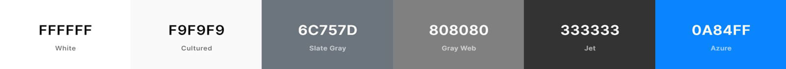
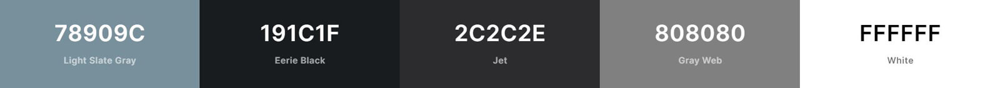

#  KCC App

[View the live project here.](https://edwarddoyle.github.io/CI-MS2-KCC-APP/)

To open links in a new tab:

MAC : &nbsp;  &nbsp; + &nbsp; 'click' 

Windows / Linux : &nbsp;   &nbsp; + &nbsp; 'click'

>This application was undertaken as my submission for the Interactive Frontend Development Milestone Project (MS2).

[viewport](assets/docs/viewport.jpg)

## Table of Contents

* [Overview](<#overview>)
* [UX](<#ux>)
  * [User Stories](<#user-stories>)
  * [Strategy](<#strategy>)
    * [Project Goals](<#project-goals>)
    * [Customer Goals](<#customer-goals>)
  * [Scope](<#scope>)
  * [Structure](<#structure>)
  * [Skeleton](<#skeleton>)
    * [Wireframes](<#wireframes>)
  * [Surface](<#surface>)
    * [Colours](<#colours>)
    * [Typography](<#typography>)
    * [Images](<#images>)
* [Features](<#features>)
* [Testing](<#testing>)
* [Technologies Used](<#technologies>)
* [Deployment](<#deployment>)
  * [Creation](<#creation>)
  * [Hosting](<#hosting>)
  * [Local](<#local>)
* [Credits](<#credits>)

## Overview

>The Kilmacow Community Clean Up App was developed in partnership with the Kilmacow Community Clean Up Group. Following on from the success of the  [KCC website](https://edwarddoyle.github.io/CI-MS1-KCC/), the group immediately began formulating plans to further develop the site and provide users with a more engaging experience. The idea of a web application was proposed. The web app allows users to contribute to the group by reporting ‘blackspots for litter’, ‘areas for improvement’ and general issues in the community that the Community Clean Up Group could address or forward onto the appropriate authorities, such as the local council.

[Back to Top](<#table-of-contents>)

## UX

### User Stories

>#### First Time Vistiors

* "I would like to inform the group of a litter issue or area for improvement"

* "I would like to upload photos to provide evidence of my concern"

* "I would like to location stamp the area of concern"

>#### Returning Visitors

* "I would like to see if any events have been added / updated since my last visit"

* "I would like to contact the KCC group about future project ideas"

* "Whilst the app is in it's testing phase, I would like to provide feedback regarding design, functionality and ideas for future features"

[Back to Top](<#table-of-contents>)

### Strategy

>#### Project goals

* Develop and deploy a minimal viable product to explore the viability of a fully functioning web application. The goal of the app is to be tranformed into a progressive web app (PWA)

* Clean UI / UX for simple navigation. Visitors are from a traditionally non-web-savvy demographic.

* Gather feedback to influence the future design and features of the app

>#### Customer goals

* Increase user engagement by providing a platform for users to contribute to the group

* Increase feedback from members

* Easy to navigate application / fimiliar interface

* Incorporate existing branding and colour scheme

[Back to Top](<#table-of-contents>)

### Scope

* The client has requested a web application with a clean, uncluttered layout that has a sense of familiarity. The app should incorporate branding and style elements of the existing website.

* The client has requested I take full ownership of the development and maintenance of the site. 

* Once the app is deployed and the KCC members begin using it, a period of time will be allowed to measure the uptake and feedback from the users. This will determine if further resources will be invested the application. 

* As my coding skills develop the future features will be added to the app.

[Back to Top](<#table-of-contents>)

### Structure

The application aims to look and feel like a native application. The app is designed in the style and framework of a SPA (Single Page Application). Upon opening the app, the user will be greeted with the 'Home Section'. This section is designed to welcome returning users and in future releases act like a social media feed with news and updates. New users will be greeted with information about the app and permission requests that will be required in order to upload photos, access their camera and provide gps for location tracking. The aim is to inform the user so they are not suspicious or unsure when the browser requests such permissions. The navigation of the app will be based upon a card system layout, the hope is it will provide familiarity to the user and will allow for adding new features without redesigning the interface. Each of the cards represents a different feature and section of the app. These cards include: "Home","Report", "Events", "Contact".

#### Home: 

#### Reports: 

#### Events:

#### Contact: 

[Back to Top](<#table-of-contents>)

### Skeleton

#### Wireframes
[Balsamiq Wireframes](https://balsamiq.com/wireframes/) was used to wireframe the website.

>* [Home Section](assets/docs/Home.pdf)
>* [Report Section](assets/docs/Reports.pdf)
>* [Events Section](assets/docs/Events.pdf)
>* [Contact Section](assets/docs/Contact.pdf)

[Back to Top](<#table-of-contents>)

### Surface

The web app uses the same typography and logo that are featured on the clients existing website. To give the app a more "native" feel a selection of familiar colours to poular apps were chosen. I believe this will elevate the appearance of the app, once it is Progressively Enhcanced (installable as a Progressive Web App).

#### Colours

The web app features 2 colour schemes (dark mode & light mode) based on the users OS / browser settings. The stylesheet contains the media query prefers-color-scheme: to determine the colour scheme displayed.

Light mode colour pallette:

Dark mode colour pallette:

#### Typography

>The font used throughout the website is Atkinson Hyperlegible, with Sans-Serif used as a fallback. The font weight and font size css attributes are used with the font for emphasis and hierarchy. Atkinson Hyperlegible was chosen, as it focuses on letterform distinction to increase character recognition, ultimately improving readability. You can find out more [here](<https://www.brailleinstitute.net/freefont>)

#### Images

>The licence for the logo is available [here](assets/docs/logolicence.pdf). Vectors were selected from my Adobe Stock account to display on the events page if no data is available and on the reports page if no previous reports were made. The licences for both are available [here](assets/docs/vectorlicence.pdf).

#### Icons

[Icomoon](https://icomoon.io/) was used to create a custom icon set. Not only does this allow you to pick and choose icons from multiple icon packs, it dramatically reduces the overhead of using fontawesome.

[Back to Top](<#table-of-contents>)

## Features

[Back to Top](<#table-of-contents>)

## Testing

> Due to the large file size, the testing section is available in it's own file 
>* [Testing](testing.md)

[Back to Top](<#table-of-contents>)

## Technologies

### Languages & Frameworks

* HTML5
* CSS3
* JavaScript

### Fonts & Icons

* [Atkinson Hyperlegible](https://www.brailleinstitute.net/freefont) - self hosted as no CDN avaialble at time of publishing
* [IcoMoon](https://icomoon.io) - Self hosted fonts

### Development, Version Control, Storage, Debbugging

* [Gitpod IDE](https://www.gitpod.io) - IDE 
* [Git](https://git-scm.com/) - version control system
* [Github](https://github.com/) - repository storage
* [Chrome DevTools](https://developers.google.com/web/tools/chrome-devtools) - used for debugging code

### Software & Applications

* [Adobe Photoshop](https://www.adobe.com/ie/products/photoshop.html) - image resizing & editing
* [Adobe Illustrator](https://www.adobe.com/ie/products/illustrator.html) - used for vector & svg editing
* [Balsamiq Wireframes](https://balsamiq.com/wireframes/) - used for wireframing website
* [Typora](https://typora.io/) - help with markdown writing & editing 
* [Microsoft Word](https://www.microsoft.com/en-ie/microsoft-365/word) - content wrtiting

### Resources

* [Tiny PNG / JPG](https://tinyjpg.com/) - compressing images
* [Am I Responsive](http://ami.responsivedesign.is/#) - viewport image for README
* [CSS Matic](https://www.cssmatic.com/box-shadow) - css box shadow generator
* [Coolors](https://coolors.co/) - colour pallette genarator, used in README surface section
* [Gradient](https://cssgradient.io/) - gradient genarator
* [JSONLint](https://jsonlint.com/) - JSON validator

### Testing

* [Validator](https://validator.w3.org/) - HTML code validator
* [Jigsaw](https://jigsaw.w3.org/css-validator/) - CSS code validator
* [GTmetrix](https://gtmetrix.com/) - Site performance testing
* [WAVE](https://wave.webaim.org/) - Site accessibility testing
* [Online Spell Check](https://www.online-spellcheck.com/) - README spell checker
* [LambdaTest](https://www.lambdatest.com/) - cross browser testing

[Back to Top](<#table-of-contents>)

## Deployment

### Creation

The project was created using the Code Institute workspace template, available [here](https://github.com/Code-Institute-Org/gitpod-full-template).
To use this template:

1. Click use this template
2. Name the new repository and select ‘Create repository from template’
3. Navigate to the newly created repository and select Gitpod*
4. The template workspace should now open in Gitpod

>*The Gitpod browser extension must be installed for this option to become visible. Gitpod provide a browser extension for Chrome [here](https://chrome.google.com/webstore/detail/gitpod-dev-environments-i/dodmmooeoklaejobgleioelladacbeki) and for Firefox [here](https://addons.mozilla.org/en-US/firefox/addon/gitpod/)

### Hosting

This website is hosted on [Github Pages](https://pages.github.com/). To deploy the live site, I followed these steps:

1. Navigate to the Github repository
2. Click the ‘Settings’ tab
3. In the Github pages section, select Master Branch as the source and click save.
4. The site URL is now displayed*

>*The site can take a period of time to go live

### Local

To run this project locally there are two options through Github (clone or download). To clone or download, navigate to the repository, click the Code button and select Clone or Download:

1. Clone: This option provides you with a URL that can be used in your local IDE. Use the 'git clone' command followed by the provided URL to create a clone of the project locally.

2. Download: This option provides a .zip file that can be downloaded, extracted and deployed to a local webserver or edited in your IDE.

[Back to Top](<#table-of-contents>)

## Credits

### Content

All text content was written by myself with approval from The Kilmacow Community Clean-up Group.

### Image

The licence for the logo is available [here](assets/docs/logolicence.pdf). The licence for the additional images are available [here](assets/docs/vectorlicence.pdf).

### Code Snippets

> CSS

* [mouse0270 bootsnip](https://bootsnipp.com/snippets/kMRrW) - The layout of the 'event cards' was inspired by mouse0270, however the code was not responsive so I replicated similar cards using flexbox

* [Ben Szabo 18/10/2017 CodePen](https://codepen.io/finnhvman/pen/jLXKJw) - android button ripple effect

* [The App Guruz](https://www.theappguruz.com/tag-tools/web/CSSAnimations/) - slideInDown & slideInLeft animations

* [Bennett Feely 25/05/2013 CoePen](https://codepen.io/bennettfeely/pen/Ftczh) - Inspiration for Google Now style cards. Code was re-written to suit

* [Shadi Abu Hilal JSFiddle](https://jsfiddle.net/shadiabuhilal/bhesp8hj/3/) - inspiration for Feedback form - recoded to include additional icons

* [kiraan 13/03/2019 CodePen](https://codepen.io/kiraan/pen/RdxgBx) - call to action button on Reports section

> JS

* [Chris Ferdinandi](https://github.com/cferdinandi/bin) - addToLocalStorageObject & getFromLocalStorageObject were inspired by Chris Ferdinandi localStorage and sessionStorage helper library. I am a huge fan of Chris.

* [Pierre Smith 26/04/2017 CodePen](https://codepen.io/kipp0/pen/pPNrrj?editors=1010) - toast notification

* [joshua.paling October 2019 Stack Overflow](https://stackoverflow.com/a/46639837/10741662) - base 64 encoding images

> a11y
* [Scott Vinkle 13/04/2018 Medium](https://medium.com/@svinkle/why-let-someone-know-when-a-link-opens-a-new-window-8699d20ed3b1) - a11y tips for screen readers

### Acknowledgements

> I would like to thank my mentor Rohit Sharma for their advice and guidance
> I would also like to give a special mention to past pupils / current tutors for their invaluable knowledge and willingness to share it on slack and on the video conferences they hosted

[Back to Top](<#table-of-contents>)
